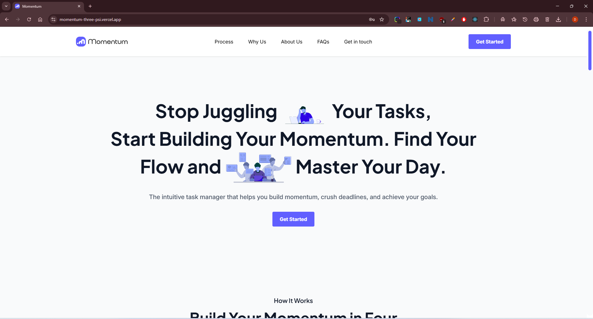

# Momentum

A full-stack todo application with modern features, beautiful UI, and robust functionality. Manage your tasks efficiently across different priorities and never miss a deadline again.



### Live Demo: [Visit Website](https://momentum-app-brown.vercel.app/)

## Authors

[@DevangPatani](https://github.com/DevangPatani08)

## 🛠 Skills
Javascript, HTML, CSS, MongoDB, Express JS, Node JS, TailWind CSS, React JS and UI/UX Design.

## 🌟 Overview

TodoApp is a comprehensive task management solution that helps individuals and teams organize their work effectively. With intelligent task categorization, automatic overdue detection, and a beautiful interface, it makes task management simple and enjoyable.

## 🎯 Key Features

### 🔐 Authentication & Security
- User registration and login
- JWT-based authentication
- Persistent sessions
- Password hashing
- User data isolation

### 📝 Task Management
- **4-Column Kanban Board**: To Do, Do Today, For Later, Overdue
- **Priority System**: Visual priority indicators
- **Smart Organization**: Automatic task categorization
- **Deadline Tracking**: Real-time overdue detection
- **Complete CRUD**: Create, read, update, delete tasks

### 🎨 User Experience
- **Responsive Design**: Works on all devices
- **Modal Interfaces**: Clean popup forms
- **Real-time Updates**: Live changes without reload
- **Confirmation Dialogs**: Safe deletion process
- **Loading States**: Smooth user feedback

### ⚡ Advanced Features
- **Auto Cleanup**: Completed tasks deleted after 30 days
- **Edit Restrictions**: Cannot edit completed tasks
- **Visual Indicators**: Color-coded priorities and statuses
- **Search & Filter**: Easy task finding (extensible)

## 🏗 Architecture

### Full-Stack Structure

    Momentum/
    ├── server/           # Node.js + Express + MongoDB API
    ├── client/           # React + Vite + Tailwind CSS
    └── README.md         # This file

## Technology Stack

| Layer | Technology |
|-------|------------|
| **Frontend** | React, Vite, Tailwind CSS, Axios |
| **Backend** | Node.js, Express.js, MongoDB, Mongoose |
| **Authentication** | JWT, bcryptjs |
| **Deployment** | Netlify (Frontend), Render/Railway (Backend) |

## 📁 Project Structure

### Backend Structure

    server/
    ├── controllers/             # Business logic
    ├── middleware/              # Auth & validation
    ├── models/                  # MongoDB schemas
    ├── routes/                  # API endpoints
    ├── index.js                # Entry point
    └── package.json

### Frontend Structure

    client/
    ├── src/
    │ ├── assets/                # Reusable UI components
    │ ├── components/            # Reusable UI components
    │ ├── pages/                 # Route components
    │ ├── context/               # State management
    │ ├── hooks/                 # Custom React hooks
    │ ├── services/              # API communication
    │ └── utils/                 # Helper functions
    ├── public/                  # Static assets
    └── package.json


## 🚀 Quick Start

### Prerequisites
- Node.js (v16 or higher)
- MongoDB (local or Atlas)
- npm or yarn

### Installation Steps

1. **Clone the repository**
```bash
    git clone <repository-url>
    cd Momentum
```

2. **Set up the Backend**
```bash
    cd backend
    npm install
    cp .env.example .env
    # Edit .env with your configuration
    npm run dev
```

3. **Set up the Frontend**
```bash
    cd ../client
    npm install
    cp .env.example .env
    # Edit .env with your API URL
    npm run dev
```

4. **Access the Application**
- Frontend: http://localhost:5173
- Backend API: http://localhost:5000

## 📚 Detailed Documentation
-  - API details, setup, and deployment
-  - UI components, features, and setup

## 🔌 API Reference

#### Authentication Endpoints
	
| Method | Endpoint     | Description                |
| :-------- | :------- | :------------------------- |
| POST | `/api/auth/register` | User registration |
| POST | `/api/auth/login` | User login |
| GET | `/api/auth/me` | Get current user |

#### Task Endpoints (Protected)

| Method | Endpoint | Description |
| :-------- | :------- | :-------------------------------- |
| GET | `/api/tasks` | Get user's tasks |
| POST | `/api/tasks` | Create new task |
| PUT | `/api/tasks/:id` | Update task |
| DELETE | `/api/tasks/:id` | Delete task |
| PATCH | `/api/tasks/:id/complete` | Toggle completion |

## 🎨 UI/UX Features

### Visual Design
- **Color Scheme:** Professional blue theme with semantic colors
- **Typography:** Clean, readable fonts
- **Icons:** Consistent Heroicons SVG icons
- **Spacing:** Tailwind CSS for perfect spacing

### User Interactions
- **Hover Effects:** Subtle animations and state changes
- **Form Validation:** Real-time input validation
- **Error Handling:** User-friendly error messages
- **Loading States:** Visual feedback for operations

### Responsive Breakpoints
- **Mobile:** < 768px
- **Tablet:** 768px - 1024px
- **Desktop:** > 1024px
## 🔒 Security Features

### Backend Security
- Password hashing with bcryptjs
- JWT token expiration
- Input validation and sanitization
- CORS configuration
- User data isolation

### Frontend Security
- Token storage in localStorage
- Protected routes
- API error handling
- XSS prevention through React

## 🚀 Deployment

### Backend Deployment (Render/Railway)
- Connect your repository
- Set environment variables
- Deploy automatically on push

### Frontend Deployment (Netlify/Vercel)
- Connect your repository
- Set build command: `npm run build`
- Set publish directory: `dist`
- Add environment variables

## Environment Variables

### Backend (.env)
```env
    NODE_ENV=production
    PORT=5000
    MONGODB_URI=your_mongodb_atlas_uri
    JWT_SECRET=your_strong_secret_key
```

### Frontend (.env)

```env
    VITE_API_BASE_URL=https://your-backend-url.com/api
```

## 🧪 Testing

### Manual Testing Checklist
- User registration and login
- Task creation with all priorities
- Task editing and updates
- Task deletion with confirmation
- Completion status toggling
- Automatic overdue detection
- Responsive design on mobile
- Form validation errors
- Authentication persistence

### API Testing

Use Postman or curl to test endpoints:

```cmd
    # Test authentication
    curl -X POST http://localhost:5000/api/auth/login \
      -H "Content-Type: application/json" \
      -d '{"email":"test@example.com","password":"password"}'
```

## 🐛 Troubleshooting

### Common Issues
1. **CORS Errors**
- Ensure backend CORS is configured for frontend domain
- Check environment variables
2. **Database Connection**
- Verify MongoDB connection string
- Check network connectivity
3. **Authentication Issues**
- Verify JWT secret matches
- Check token storage in frontend
4. **Build Issues**
- Clear node_modules and reinstall
- Check Node.js version compatibility

### Debugging Tips
- Check browser console for frontend errors
- Monitor backend logs for API issues
- Verify environment variables
- Test API endpoints directly

## 🔮 Future Enhancements

### Planned Features
- Task search and filtering
- Task categories/tags
- File attachments
- Email notifications
- Team collaboration
- Calendar integration
- Mobile app
- Dark mode

### Technical Improvements
- Unit and integration tests
- API rate limiting
- Database indexing optimization
- PWA capabilities
- Real-time updates with WebSockets

### Development Standards
- Follow existing code style
- Write meaningful commit messages
- Update documentation
- Test thoroughly

## 📄 License
This project is licensed under the MIT License - see the [LICENSE](https://choosealicense.com/licenses/mit/) file for details.


## 👥 Team
- Devang Mrugesh Patani - Designer and Developer
- Shreyas Sir - Mentor TuteDude MERN STACK

## 🙏 Acknowledgments
- React team for the amazing framework
- Tailwind CSS for the utility-first CSS
- MongoDB for the robust database
- Vite for the fast build tooling
- Shreyas sir for excelent mentorship at TuteDude.
- Tutedude for the amazing MERN Stack Development Course

## 📞 Support
If you have any questions or need help:
- Create an issue in the repository or 
- Email: devang.patani0806@gmail.com


<div align="center" style='margin-top: 2rem; padding: 2rem;'>

<h1 style='border: none; text-decoration: none;'>🚀 Built with ❤️ using the MERN Stack</h1>

<h2 style='border: none; text-decoration: none;'>📚 Documentation</h2> 

<a href='https://github.com/DevangPatani08/Momentum/blob/version1.0.0/server/backend.md'>Backend API Docs</a> • 
<a href='https://github.com/DevangPatani08/Momentum/blob/version1.0.0/client/README.md'>Frontend Guide</a>

<h2 style='border: none; text-decoration: none;'>🌐 Live Demo</h2>

<a href="https://momentum-app-brown.vercel.app/"><strong>Visit Live Application</strong></a>

<h2 style='border: none; text-decoration: none;'>📞 Support</h2>

<a href="https://github.com/DevangPatani08/Task_Management_App_Project/issues">Report Issue</a> • 
<a href="mailto:devang.patani0806@gmail.com">Contact Me</a>


*If you found this project helpful, please give it a ⭐ star on GitHub!*

</div>